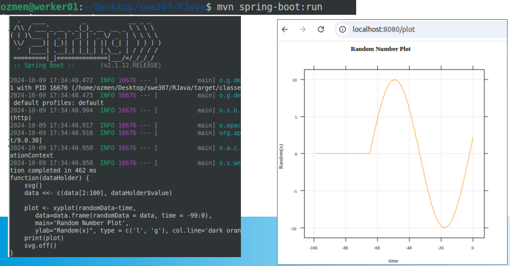

# SWE307-2024 BIG DATA

## Projects:

<table>
  <header>
    <th>No</th>
    <th>Project Title</th>
    <th>Tasks</th>
    <th>Due Date</th>
    <th>Other</th>
  </header>
  <body>
    <tr>
      <td>1</td>
      <td><b>Data visualization.</b></td>
      <td>
        <b>a)</b> Every person in the group must install GraalVM and able to run the project that you are supposed to implement as a group.  
        <b>b)</b> Groups will use the attached CSV file as data source. Use only one column in this study, such as first group will use only *Col-1* data. There are 100 rows (100 data) in the file, and this file will be opened, read by Java not R. 
        <b>c)</b> Your Java program will read one consequtive row every second from the file, and the double number read will be sent to the R function for plot as shown in the class. 
        <b>d)</b> referebly use *xyplot()* from lattice library. In your plot, x axis will be integer from [0-99] and y axis will plot the double value sent from your Java program. 
        <b>e)</b> Your plot should be *line* type and the line color should be *dark brown*. Use *grid* in your graph. 
        <b>f)</b> Example output: .
      </td>
      <td>24 October 2024  </td>
      <td><a href="pro1.pdf">Project1</a></td>
    </tr>
    <tr>
      <td>2</td>
      <td><b>Hadoop-HDFS (or G-Drive, AWS-S3) acess from web app.</b></td>
      <td>
        <b>a)</b> Employee and department data will be read from the database (see <a href="https://github.com/ozmen54/SWE307-2023/blob/main/Pro1/pro-1.png">Figure 1</a>) (<a href="https://github.com/ozmen54/SWE307-2023/tree/main/Pro1/data">CSV files</a>). Implement CRUD operations on employee table.  
        <b>b)</b> Employee images will be taken directly from HDFS (use these <a href="https://github.com/ozmen54/SWE307-2023/tree/main/Pro1/images">example image files</a>). 
        <b>c)</b> There will be a single web page, on this page the information will be displayed in a table using the JOIN operation. Information to display: employee name, manager name, salary, commission, department (see <a href="https://github.com/ozmen54/SWE307-2023/blob/main/Pro1/Screenshot.png">Figure 2</a>).  
        <b>d)</b> Show that the user image file uploading and displaying them on the web page work.  
        <b>e)</b> Show that your application runs as expected.
      </td>
      <td>8 November 2024 </td>
      <td><a href="pro2.pdf">Project2</a></td>
    </tr>
    <tr>
      <td>3</td>
      <td><b>Kafka-Spark-Cassandra Data Path</b></td>
      <td>
        <b>a)</b> You are going to implement big data system shown in <a href="https://github.com/ozmen54/SWE307-2024/blob/main/pro-3.pdf">Figure 1</a>.  
        <b>b)</b> You need to create a console application that genarates random data as described in the project document (<a href="https://github.com/ozmen54/SWE307-2024/blob/main/pro3.pdf">Project 3</a>). You can implement this server using any language as you wish.  
        <b>c)</b> You need to install Kafka, Spark and Cassandra along with Hodoop-HDFS.  
        <b>d)</b> You need to start up Kafka with the topics assigned to each user. Kafka will start queuing incoming expense records. 
        <b>e)</b> You will write some Spark scripts using Scala or Python that will fetch records on Kafka topics periodically in a loop. Every new record must be stored on Cassandra.  
        <b>f)</b> When e request comes from controller endpoint, the Spark routine must answer this as described in Project documentation.  
        <b>g)</b> There will be a single web page on your sytem that shows the similar output as you did on Project 2, however in this time there will be another column that shows instantaneous total expens amount.  
      </td>
      <td>13 December 2024 </td>
      <td><a href="pro3.pdf">Project3</a></td>
    </tr>
</body>
</table>
